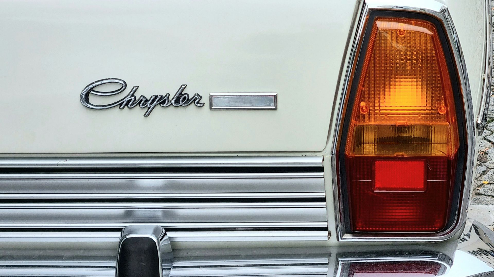
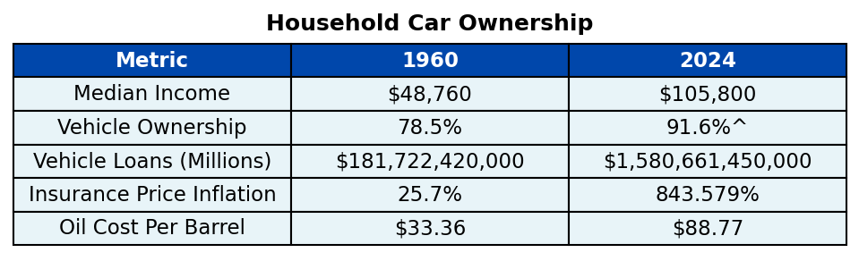

Owning a vehicle is a staple of the typical American family, serving as a way to commute to work, transport children to school, and access groceries and other essential needs. Vehicle ownership became popular in the 1910s with the release of the Ford Model T, which could quickly be manufactured and mass-produced [@lacy2003]. However, it wasn't until post-World War ll in the 1950s when suburbanization took over that vehicle ownership became a need for most families [@campbell2023]. In analyzing wage and vehicle-related data, we can look into whether from 1960 to now it has become more accessible and affordable for an American family to have a vehicle.

{width=100%}

## U.S. Household Income

To look at how accessible acquiring a vehicle has become, one of the first things that is important to analyze is how family wages have changed over time. Since 1960, the median household income (adjusted for inflation) has gradually increased from $48,760 in 1960 to $105,800 in 2024. With increased purchasing power, it would generally seem that families would have more bandwidth to purchase a vehicle.

```{=html}
<iframe src="plots/plot1.html" width="90%" height="400px" frameborder="0" style="display:block; margin: 0 auto;"></iframe>
```

However, something noticeable from the plot above is that the line is not perfectly straight and there are multiple dips within our timeline. Below we compare the difference in the median income from the current year to the year before. 

```{=html}
<iframe src="plots/plot1.5.html" width="90%" height="425px" frameborder="0" style="display:block; margin: 0 auto;"></iframe>
```

Hovering over the plot, we can see some years of stark increases in median income such as in 2015 and 2019, but also areas where the median income continued to decrease over the course of multiple years. When analyzing these groups of years, we can observe that they mainly coincide with U.S. recessions. Specifically, the following years have been defined as recessions by FRED (Federal Reserve Bank of St. Louis) and also have decreasing annual median incomes: 1974-1975, 1980-1982, 1990-1991, 2001-2002, 2008-2009, and 2020 [@fred]. While median income has generally increased, we also want to observe whether recessions not only had impacts on income, but also the various other vehicle-related variables being explored.

## Vehicle Ownership

One of the other trends that's important to observe is the percentage of families that own vehicles from 1960 to now. Since this is a slower moving trend, we'll look at the percentage at the start of every decade in comparison to some of the most recent years.

```{=html}
<iframe src="plots/plot2.html" width="90%" height="450px" frameborder="0" style="display:block; margin: 0 auto;"></iframe>
```

Using the dropdown, we can see how the trend in vehicle ownership differs for zero through three or more vehicle households. The number of households without any vehicles continued to decrease through 1990 before plateauing. Similarly the number of single vehicle houses also decreased before plateauing around 1990, however, single vehicle households clearly still make up the majority of households. Interestingly, two vehicle households have significantly increased from 19.1% in 1960 to 36.5% in 2023 and three or more vehicle households jumped from 2.5% in 1960 to 21.7% in 2023. All of this would go to indicate that vehicles are more accessble for families from 1960 to now given the clear trend in vehicle ownership.

Comparing the percentage of households with zero vehicles against the total historic motor vehicle loan amount, we can see that as vehicle financing has become easier to secure, the number of households with no vehicles has decreased.

```{=html}
<iframe src="plots/plot2.5.html" width="90%" height="750px" frameborder="0" style="display:block; margin: 0 auto;"></iframe>
```

Looking at median income and household vehicle ownership, we have seen that since 1960, both have generally gone up despite intermediate recessions. However, just because vehicle owernship is more accessible, in part due to increased income and financing, it doesn't necessarily mean it's more affordable. Below we scrutinize the difference between the two.

## How Affordable is Accessability?

Besides the sunk cost of purchasing a vehicle, which we explored above with motor vehicle loans, there are many other long-term finances that go towards affording a vehicle. One such expense is motor vehicle insurance, which covers damage done during an accident and is required by law in almost every U.S. state [@brock]. Below we compare the price inflation percentage of motor vehicle insurance compared to the average price inflation percentage for that year.

```{=html}
<iframe src="plots/plot3.html" width="100%" height="425px" frameborder="0" style="display:block; margin: 0 auto;"></iframe>
```

As we can see, around the late 1980s motor vehicle price inflation noticeably eclipses the average price inflation for that year, indicating motor vehicle insurance became much more expensive than the majority of goods and services purchased by households. By 2024, motor vehicle insurance sat at 843.6%, more than twice the average price inflation that year. Interestingly, during recession years the price inflation looks to plateau as seen in 2001 and 2008 or even drop as seen in 2020, suggesting during recessions less people are using their vehicles to save money and therefore prices go down. Overall, while more American families may be financing vehicles, associated costs such as motor vehicle insurance are only continuing to get more expensive.

Another expense for most vehicle owners is fuel. Below we examine the inflation adjusted cost per barrel of oil since 1960. Select a bar in the top plot to see its associated trend throughout the year.

```{=html}
<iframe src="plots/plot4.html" width="100%" height="725px" frameborder="0" style="display:block; margin: 0 auto;"></iframe>
```

There are many geopolitical factors that impact the cost of oil, however, one of the interesting takeaways we see are the timeframes in which oil prices spike. When selecting 1979, we see the steep price increase throughout the year, culminating in extremely high prices throughout 1980, which marked the beginning of an economic recession. Similarly, selecting 2007 shows the gradual increase in price until a record high in 2008, which also marked the beginning of another recession. On a smaller scale these same trends can be seen in 1974 and 1990, two other U.S. recession periods. However, besides the COVID-19 anomaly in 2020, inflation-adjusted prices are generally higher now than they were in the 1960s and are also, as demonstrated, extremely volatile.

## Summary

In this assessment, we explore both the accessibility and affordability of vehicles in the United States from 1960 to now. Throughout this effort, the focus was on a few key metrics, namely: median household income, vehicle ownership, vehicle financing, motor vehicle insurance, and oil cost per barrel. Below are the highlights.



## Conclusion
Since 1960, more American households are able to own vehicles. This is likely in part due to rising household incomes and the increased ability to acquire a loan to finance purchasing a vehicle. Therefore, the quality of living for the average household has increased since 1960 as the majority of households today have access to at least one vehicle, and many have access to even more. However, while accessability has increased, affordability has not. While motor vehicle loans have significantly increased, indicating more people are able to finance vehicles, it also suggests more people owe money on their vehicles and are in debt. The cost of long-term items needed to support vehicle ownership, including insurance and oil needed for fuel have also increased, meaning the average household has to set aside a significant amount of money to maintain owning a vehicle. Economic recessions throw these trends out of balance as oil prices spike and median income goes down, which generally leads people to drive less and therefore vehicle insurance becomes lower than expected as well.